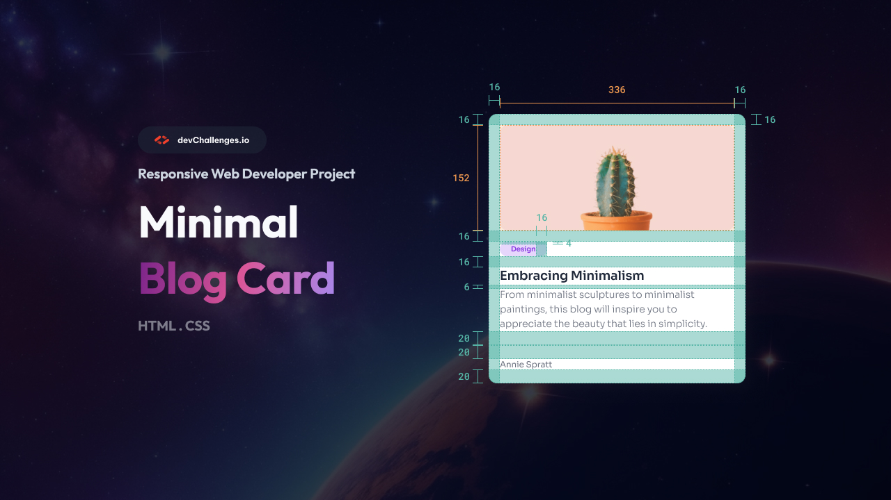

# Minimal Blog Card | devChallenges

   Solution for a challenge <a href="https://devchallenges.io/challenge/minimal-blog-card-challenge" target="_blank">Minimal Blog Card</a> from <a href="http://devchallenges.io" target="_blank">devChallenges.io</a>.

  <h3>
    <a href="#">
      Demo
    </a>
     | 
    <a href="https://devchallenges.io/challenge/minimal-blog-card-challenge">
      Challenge
    </a>
  </h3>

## Table of Contents

- [Overview](#overview)
  - [What I learned](#what-i-learned)
  - [Useful resources](#useful-resources)
- [Built with](#built-with)
- [Features](#features)
- [Acknowledgements](#acknowledgements)
- [Author](#author)

## Overview

This project tackles the creation of a simple yet elegant blog card component. Think of it as building one of those preview cards you see scattered across modern websites – the kind that makes you want to click and read more.

The challenge seemed straightforward at first: create a card with an image, title, description, and tag. But diving into it revealed how much thought goes into seemingly simple designs. Every spacing decision, color choice, and typography detail matters when you're crafting something that needs to catch a reader's eye.

### What I learned

Building this blog card was like taking apart a watch to see how it ticks – suddenly you notice all the tiny pieces working together.

- **Wrestling with CSS fundamentals**: The box model stopped being this mysterious concept and became more like understanding how boxes stack in a closet. Getting the spacing just right took more tweaking than expected, but that's where the magic happens.

- **Making images behave**: Images can be surprisingly stubborn and There's an art to making images look effortless.

- **Designing the tag element**: How do you make a small text element stand out without screaming for attention? The answer lies in subtle background colors, gentle padding, and just the right amount of border-radius.

- **Crafting visual hierarchy**: Learning to guide a reader's eye through the card felt like directing a small play. The title needs to grab attention first, the description should invite them in, and the tag provides context without competing for the spotlight.

### Useful resources

- [MDN Web Docs - HTML Basics](https://developer.mozilla.org/en-US/docs/Learn/Getting_started_with_the_web/HTML_basics) - This became my go-to when I wasn't sure which HTML element made the most sense. The examples are clear and practical.
- [MDN Web Docs - CSS Basics](https://developer.mozilla.org/en-US/docs/Learn/Getting_started_with_the_web/CSS_basics) - Saved me countless times when CSS wasn't doing what I expected. The explanations actually make sense.
- [CSS-Tricks - Box Model](https://css-tricks.com/the-css-box-model/) - Finally made the box model click for me. Those diagrams are worth their weight in gold.
- [Web.dev - Learn Responsive Design](https://web.dev/learn/design/) - Helped me understand why my images looked weird on different screen sizes and how to fix it.

## Built with

- Clean HTML5 markup
- Vanilla CSS (no frameworks needed)
- Flexbox for layout magic
- Custom CSS properties for easier maintenance

## Features

This blog card packs more thought into its simple appearance than you might expect:

- **Responsive image handling**: The hero image adapts gracefully across different screen sizes without losing its visual punch or getting distorted.

- **Typography that works**: The title draws you in, the description gives you just enough detail to stay interested, and the tag provides context without cluttering things up. 

- **Clean, modern aesthetics**: The card strikes that sweet spot between minimal and engaging.

- **Flexible and reusable**: The component is built to work well on its own or as part of a larger layout. The CSS is organized enough that tweaking colors or spacing won't break everything else.

This was my submission to a [DevChallenges](https://devchallenges.io/challenges-dashboard) challenge, and it turned out to be a great way to practice the fundamentals without getting overwhelmed by complex features.

## Acknowledgements

- [DevChallenges.io](https://devchallenges.io/) for creating challenges that actually teach you something useful
- [MDN Web Docs](https://developer.mozilla.org/) for having documentation that doesn't make you feel stupid
- [CSS-Tricks](https://css-tricks.com/) for explaining CSS in ways that finally make sense
- [Unsplash](https://unsplash.com/) for beautiful images that make even practice projects look professional

## Author

- Website [MinimalBlogCard](#)
- GitHub [@nana-v1](https://github.com/nana-v1)